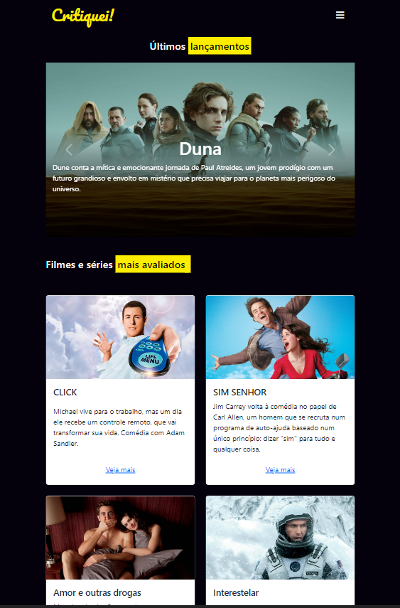

# Critiquei! - A simple page site for your favorite movies reviews 

  

  <a href="#-tecnologias">Tecnologias</a>&nbsp;&nbsp;&nbsp;|&nbsp;&nbsp;&nbsp;
  <a href="#projeto">Projeto</a>&nbsp;&nbsp;&nbsp;|&nbsp;&nbsp;&nbsp;
  <a href="#desafio">Desafio</a>&nbsp;&nbsp;&nbsp;|&nbsp;&nbsp;&nbsp;
  <a href="#O-que-aprendi">O que aprendi</a>&nbsp;&nbsp;&nbsp;|&nbsp;&nbsp;&nbsp;
  <a href="#referências">Referências</a>&nbsp;&nbsp;&nbsp;|&nbsp;&nbsp;&nbsp;

## 🚀 Tecnologias

Esse projeto foi desenvolvido com as seguintes tecnologias:

- HTML e CSS
- JavaScript
- Bootstrap
- Git e Github

## Projeto

O site Critiquei! é uma página voltada para reunir criticas de cinema e medir a satisfação dos espectadores com determinada experiência. seja um filme ou uma série.

## Desafio

Como parte de um exercicio para Bootstrap, o desenvolvedor deve ser capaz de:

- Desenvolver um site responsivo utilizando op sistema de colunas do framework
- implementar componentes do Bootstrap, como o carousel e cards

## O que aprendi

Bootstrap sempre foi um frameowrk voltado para ajudar os desenvolvedores front-end a ter uma layout mais responsivo e a adicionar componentes complexos com poucas classes e atributos, mas eu sempre tive uma certa dificuldade com ele, e este projeto foi de grande auxilio para meu aprendizado

- Layouts responsivos com Bootstrap
- Componentes do framework

## Referências

A inspiração do Critiquei! veio de um exercicio proposto pelo curso full-stack com python da EBAC, sendo a principal referencia de seu layout o serviço de streamming da HBO.